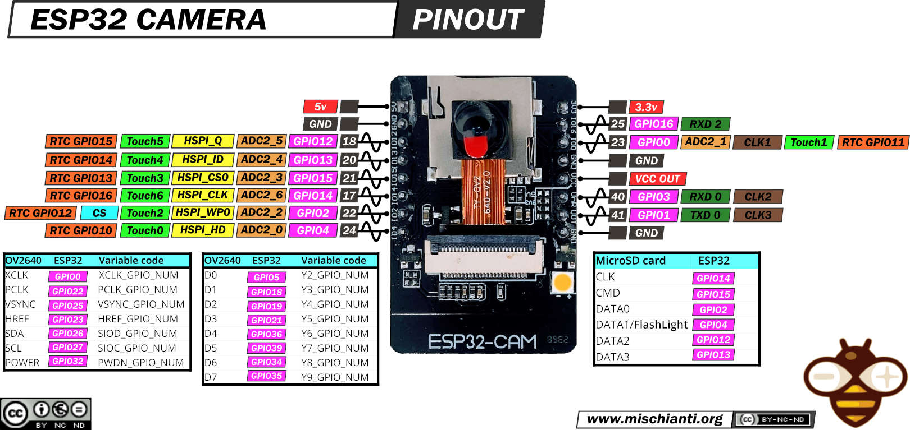

# ESP32-CAM program with Arduino IDE

- This version let ESP32-CAM to run AP (Access Point) mode
- Once powered, use portable device with WIFI enabled to connect
  - Initial SSID: testAP-ardu
  - Initial Password: 123456789
- ESP32-CAM with motherboard seems to deactivate GND pin on 3V3 side (pin 16)
  - When ESP32-CAM-MB without motherboard is connected straight to power source (5V, GND), it doesn't turn on
  - Connect GND next to 5V pin (pin 2) instead (works on both ESP32-CAM only and ESP32-CAM with MB)

